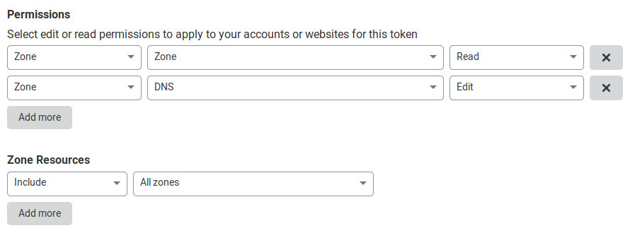

# ddns

**ddns** is a dynamic DNS tool for [Cloudflare](https://www.cloudflare.com/) domains. It sets A and AAAA records for a domain to your systems public IP addresses as appropriate.

## Installation

Installation is simple and no different to any Go tool. The only requirement is a working [Go](https://golang.org/) install.

```
go get go.tmthrgd.dev/ddns
```

## Usage

Usage is simple with the `ddns` command taking the domain name to set.

```
ddns host.example.com
```

You need to set the `CF_API_TOKEN` environment variable to a valid Cloudflare API Token with the `#zone:read` and `#dns_records:edit` permissions. Unfortunately access must be provided to all zones even those that will not be updated. You can create a new API Token on the [API Tokens page](https://dash.cloudflare.com/profile/api-tokens) of the Cloudflare dashboard. The token should be created with the following permissions:



## License

[BSD 3-Clause License](LICENSE)

## Notes

[SeeIP](https://seeip.org/) is used to resolve your systems public IPv4 and IPv6 addresses.